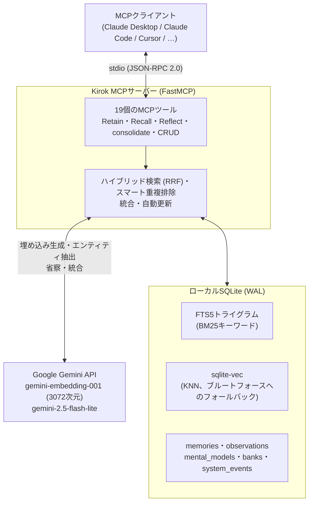

# Kirok

[English](README.md) | 日本語

[](https://github.com/TadFuji/kirok-mcp/actions/workflows/test.yml)
[](LICENSE)
[](https://www.python.org)
[](CHANGELOG.md)

**AIエージェントのための永続メモリ、MCP経由で。** Kirok（記録）は [Model Context Protocol](https://modelcontextprotocol.io) サーバーであり、エージェントに永続的で検索可能なメモリを与えます。重要なことを **Retain**（保存）し、意味検索とキーワード検索を組み合わせたハイブリッド検索で **Recall**（想起）し、蓄積したメモリを再利用可能な洞察へと **Reflect**（省察）で蒸留します。バックグラウンドの統合ループが、生のメモリをより高次の *observations（観察）* へと自律的に変換します。

## Kirokを選ぶ理由

世間の「エージェントメモリ」の多くは、素朴なベクトルストア（recall がただのコサイン類似度 top-k で、キーワードの裏付けも忘却の仕組みもない）か、エージェントが毎ターン読み直す羽目になる Markdown の山かのどちらかです。Kirok は、検索エンジニアリングをきちんとやり遂げる、自前でホストできる小さなサーバーです。

- **ベクトルだけでなくハイブリッド検索。** 意味検索（KNN）と FTS5 の BM25 を Reciprocal Rank Fusion で融合しているため、完全一致するキーワードと意味的な一致が競合するのではなく、互いを補強し合います。
- **実測に基づく類似度の下限値（フロア）。** 素朴なコサイン閾値は実際の埋め込み分布ではうまく機能しません（[検索品質](#-検索品質)を参照）。Kirok のフロアは実データに対して測定されており、それを裏付ける評価ハーネスも用意されています。
- **自律的な統合（consolidation）。** メモリは定期的に統合され observation として合成されます。また、破壊的な LLM の判断は無条件に実行されるのではなく、監査証跡付きでソフトデリート（論理削除）されます。
- **信頼性を最優先。** アトミックな書き込み、ソフトデリート、起動時の自動スナップショット、`retain` を絶対に失わない fail-open（失敗時も開いたまま動き続ける）なバックグラウンドパイプライン。

**ローカル完結ではありません:** ストレージは自分で保有するローカルの SQLite ファイルですが、埋め込みと LLM 推論は Google の Gemini API に送信されます。すべてをデバイス内で完結させる必要がある場合、Kirok は（今のところ）向いていません。

## アーキテクチャ



ストレージは `~/.kirok/memory.db` に置かれた単一の SQLite データベースです。`sqlite-vec` がバンクごとのベクトル KNN 検索を提供し、ネイティブ拡張が読み込めない場合は Kirok が NumPy によるブルートフォース走査に自動フォールバックし、結果は同一になります。全体設計については [docs/architecture.md](docs/architecture.md) を参照してください。

## 🚀 クイックスタート

**必要なもの:** Python 3.12+、[uv](https://docs.astral.sh/uv/)、そして [Gemini API キー](https://aistudio.google.com/apikey)（無料枠で十分です）。

```bash
git clone https://github.com/TadFuji/kirok-mcp.git
cd kirok-mcp
uv sync                       # sqlite-vec を含む依存関係をインストール
cp .env.example .env          # 作成した .env にキーを記入: GEMINI_API_KEY=AIza...
uv run kirok-doctor           # セットアップ全体をオフラインで健全性チェック
```

### MCPクライアントと接続する

**Claude Desktop** — `claude_desktop_config.json` を編集します（macOS: `~/Library/Application Support/Claude/`、Windows: `%APPDATA%\Claude\`）。

```json
{
  "mcpServers": {
    "kirok": {
      "command": "uv",
      "args": ["run", "--directory", "/absolute/path/to/kirok-mcp", "kirok-mcp"]
    }
  }
}
```

**Claude Code CLI:**

```bash
claude mcp add kirok -s user -- uv run --directory /absolute/path/to/kirok-mcp kirok-mcp
```

その後クライアントを再起動してください。`GEMINI_API_KEY` は `.env` から読み込まれるため、設定ファイルに書く必要はありません。

> [!TIP]
> **`uv run` がサーバーの起動に失敗する場合**（Windows やクラウド同期フォルダでよくある現象です。`uv run` は起動のたびに再同期を行うため、ロックされた `.venv` ファイルや使用中のエントリーポイント `.exe` に引っかかることがあります）、venv の Python を直接呼び出して同期自体を丸ごとスキップできます。
>
> ```json
> {
>   "mcpServers": {
>     "kirok": {
>       "command": "/absolute/path/to/kirok-mcp/.venv/bin/python",
>       "args": ["-m", "kirok_mcp.server"],
>       "env": { "PYTHONPATH": "/absolute/path/to/kirok-mcp/src" }
>     }
>   }
> }
> ```
>
> Windows では `.venv\\Scripts\\python.exe` を使い、JSON 内のパスはバックスラッシュを二重にしてください。

[`skills/kirok/`](skills/kirok/) に同梱されたエージェントスキルが、メモリツールをいつ・どう使うかをエージェントに自律的に教えます。クライアントに `skills/kirok/SKILL.md` を指定して有効化してください。

## 🛠️ ツール

19個のMCPツールがあります。以下は一行要約です。全パラメータの詳細は [docs/tools-reference.md](docs/tools-reference.md) を参照してください。

**コア**

| ツール | 用途 |
|------|---------|
| `KIROK_retain` | メモリを保存する: エンティティ/キーワード抽出 + 埋め込み生成 + スマートな ADD/UPDATE/NOOP 重複排除 |
| `KIROK_recall` | ハイブリッドな意味検索 + キーワード検索（RRF）、observation を優先表示 |
| `KIROK_reflect` | メモリを統合してメンタルモデル（洞察）を生成する。自動更新も可能 |
| `KIROK_smart_retain` | まず重要度（1〜10）をスコアリングし、閾値を超えた場合のみ保存する |
| `KIROK_consolidate` | 特定バンクの observation 統合を手動で実行する |

**メモリ管理**

| ツール | 用途 |
|------|---------|
| `KIROK_get_memory` / `KIROK_list_memories` | 単一メモリの取得 / ページネーション付きでバンクを閲覧 |
| `KIROK_update_memory` | 内容やコンテキストを編集する（内容変更時は再抽出・再埋め込みを実行） |
| `KIROK_forget` | 単一メモリを削除する（元に戻せません） |

**メンタルモデル**

| ツール | 用途 |
|------|---------|
| `KIROK_list_mental_models` / `KIROK_get_mental_model` | Reflect から生まれた洞察の一覧 / 詳細表示 |
| `KIROK_refresh_mental_model` | 現在のメモリに対して再分析する |
| `KIROK_delete_mental_model` | メンタルモデルを削除する（元に戻せません） |

**バンク**

| ツール | 用途 |
|------|---------|
| `KIROK_list_banks` / `KIROK_stats` | 件数付きのバンク一覧 / バックグラウンド障害を含む詳細なバンク別統計 |
| `KIROK_clear_bank` | バンク内のメモリと observation を削除する（`confirm=true` が必須。それ以外はプレビューのみ） |
| `KIROK_delete_bank` | バンクごと削除する（`confirm=true` が必須。それ以外はプレビューのみ） |

**設定**

| ツール | 用途 |
|------|---------|
| `KIROK_set_bank_config` / `KIROK_get_bank_config` | バンクの retain・observation の「ミッション」（何に注目するか）を設定 / 表示する |

## ⚙️ 設定

すべて環境変数（通常は `.env`）で設定します。必須なのは `GEMINI_API_KEY` のみです。

| 変数 | デフォルト | 説明 |
|----------|---------|-------------|
| `GEMINI_API_KEY` | — | **必須。** Google Gemini API キー。 |
| `KIROK_DB_PATH` | `~/.kirok/memory.db` | SQLite データベースの場所。 |
| `KIROK_DEDUP_THRESHOLD` | `0.85` | このコサイン類似度を超えると、retain が LLM による重複排除（ADD/UPDATE/NOOP）判定を呼び出す。 |
| `KIROK_RECALL_MIN_SIMILARITY` | `0.62` | recall における意味検索ヒットの類似度フロア。キーワード/FTS ヒットは対象外。 |
| `KIROK_OBS_MIN_SIMILARITY` | `0.62` | observation ヒットの類似度フロア。 |
| `KIROK_CONSOLIDATION_BATCH_SIZE` | `5` | 保留中のメモリがこの件数に達したときだけ自動統合を実行する（`1` は毎回 retain のたびに実行）。 |
| `KIROK_CONSOLIDATION_TIMEOUT` | `120` | 統合処理のタイムアウト（秒）。 |
| `KIROK_REFLECT_TIMEOUT` | `300` | Reflect のタイムアウト（秒）。 |
| `KIROK_AUTO_SNAPSHOT_HOURS` | `24` | 起動時自動スナップショットの最小間隔（時間）。`0` で無効化。 |
| `KIROK_SNAPSHOT_KEEP` | `5` | 自動スナップショットを何世代保持してから古いものをローテーション削除するか。 |

## 🔍 検索品質

Recall は意味検索の KNN と FTS5 の BM25 を並列に実行し、Reciprocal Rank Fusion（`k=60`）で融合します。日本語の短いキーワードクエリには特別な処理があります。1〜2文字の漢字・カタカナのトークンは、トライグラム・トークナイザーの3文字ウィンドウに満たないため決して `MATCH` できませんが、BM25 のヒットの後ろに追加される完全部分一致の `LIKE` 補完によって救済されます（ひらがなのみの短いトークンはこの対象から除外されます。機能語がバンクの半分に部分一致してしまうためです。トークンは MATCH 側と同じく OR 結合です）。

ハイブリッド検索を誠実に保つための工夫が3つあります。各ソースは最終ページより深く（`max(limit*3, 30)` 件）取得されるため、両リストで惜しくも圏外だった項目を RRF が昇格させられます。FTS のテキストは索引側・クエリ側の両方で NFKC 正規化されるため、幅違いの表記（ＭＣＰ と MCP、ﾊﾞｸﾞ と バグ）が実際に一致します。そして観測（observations）にもメモリと同じハイブリッド処理が適用されます — 意味ヒットにはフロア、キーワードヒットはフロア免除 — 以前は意味検索のフロア経由でしか到達できませんでした。

**類似度フロアは実データで較正されています。** 素朴なコサイン閾値はここではうまく機能しません。実際の `gemini-embedding-001` ベクトルの分布は狭く、無関係なクエリでも無関係なバンクに対して **0.55〜0.62** のスコアが出る一方、真にヒットすべきものは **0.66〜0.73** のスコアになります。そのため実用可能なフロアは、無関係クエリの上限値の *すぐ上*、**0.62** に置かれています。これがなければ、無関係なクエリでも空でないバンクからメモリが1ページ分丸ごと返ってきてしまいます（コンテキスト汚染）。逆に閾値を大きく下げすぎると、フロアが何も除外しなくなります（旧来のハードコードされた `0.4` は無関係クエリのスコアより低い値でした）。FTS のキーワードヒットはこのフロアを完全にバイパスします。リテラルな用語の一致は、弱いベクトルスコアではなく独立した根拠だからです。

検索パラメータは勘で調整されていません。[`scripts/search_eval.py`](scripts/search_eval.py) は、サーバーが使うのと *まったく同じ* recall パイプライン（`hybrid_search_memories` として抽出されているため、評価ハーネスが本番実装から乖離できません）に対してゴールデンクエリセットを実行し、hit@1/hit@5/hit@k と MRR を報告します。

```bash
cp scripts/search_eval.example.json my_golden.json   # 実際のケースを30〜50件追加する
uv run python scripts/search_eval.py my_golden.json --limit 10
```

## 🛡️ 信頼性

- **アトミックな統合処理。** すべての作成・更新の埋め込みは DB への書き込みより *前に* 生成されます。observation へのすべての変更と「統合済み」のマークは、単一のトランザクションでコミットされます。どのステップで失敗しても、データベースは失敗前と完全に同じ状態のまま残り、対象のメモリは後で再試行できるよう保留状態に維持されます。中途半端に適用されたバッチは決して発生しません。
- **失敗は必ず表面化し、偽の成功に化けません。** 統合処理の LLM が失敗した場合は例外として扱われ `system_events` に記録されます。何も生成されないままバッチが黙って「統合済み」になることはなく、保留のまま次回に再試行されます。統合はバンク単位で直列化されるため、retain が立て続けに走っても同じバッチが二重処理されて重複した observation が生まれることはありません。
- **監査証跡付きソフトデリート。** 統合処理の LLM が削除すべきと判断した observation は、破棄されるのではなく `deprecated_at` が刻印されます（検索・一覧・統計からは除外されます）。また、重複排除の UPDATE はマージ前の内容を、マージ本体と同一のトランザクションで記録します。どちらも `system_events` にログが残るため、LLM の誤った判断があっても復旧可能で、データが黙って失われることはありません。
- **起動時の自動スナップショット。** 起動時、最新の自動スナップショットが `KIROK_AUTO_SNAPSHOT_HOURS` より古ければ、`VACUUM INTO` + `integrity_check` によるスナップショットが `~/.kirok/backups/` 配下に書き出され、直近 `KIROK_SNAPSHOT_KEEP` 世代分が保持されます。途中で失敗したスナップショットは壊れたファイルを残しません。また、手動バックアップはローテーション対象になりません。
- **並行性。** 各接続は `PRAGMA busy_timeout=30000` を設定しているため、2つ目の MCP クライアントは `database is locked` で失敗する代わりに、書き込み中のクライアントの完了を待ちます。
- **Fail-open なバックグラウンド処理。** 自動統合とメンタルモデルの再更新は `retain` の背後で実行され、`retain` 自体を失敗させることは絶対にありません。エラーは握りつぶされて `system_events` に記録され、`KIROK_stats` 経由で可視化されるため、静かな機能劣化が見過ごされることはありません。

## 💾 バックアップと復元

すべての状態は1つの SQLite ファイルに集約されています。オフラインの `kirok-backup` CLI は API キーを必要としません。

```bash
uv run kirok-backup snapshot        # バイトレベルの DB コピー（サーバー稼働中でも安全）
uv run kirok-backup export          # 全バンク + メモリ + observation + モデルの可搬な JSON
uv run kirok-backup import ~/.kirok/backups/kirok-export-YYYYMMDD-HHMMSS.json
```

`snapshot` と `export` は `~/.kirok/backups/` 配下にタイムスタンプ付きファイルを書き出し、既存ファイルの上書きは拒否します。`import` は単一トランザクションで実行され（オールオアナッシング）、既存の ID は上書きせずスキップし、FTS とベクトルインデックスを再構築するため検索がすぐに機能します。別のデータベースファイルを対象にするには `--db` を使ってください。

## 🩺 診断

```bash
uv run kirok-doctor            # オフライン: Python のバージョン、.env、キーの有無（値は出力しません）、
                               # 必要なモジュール、FTS5、sqlite-vec、DB への書き込み可否
uv run kirok-doctor --json     # 自動化向けの機械可読な出力
uv run kirok-doctor --online   # Gemini への疎通確認のため、実際の埋め込み呼び出しを1回追加する
```

## 🧑‍💻 開発

```bash
uv sync
uv run --no-sync pytest        # 164件のオフラインテスト。API キーもネットワークも不要
```

このテストスイートは完全にオフラインです。`kirok_mcp.server` のインポートは副作用を持たず（API キーの確認はインポート時ではなく起動時に行われます）、テストは Gemini クライアントをフェイクに差し替えます。CI は push のたびに Ubuntu と Windows で同じスイートを実行します（[.github/workflows/test.yml](.github/workflows/test.yml)）。プルリクエストを送る前に [CONTRIBUTING.md](CONTRIBUTING.md) を参照してください。

## 📚 ドキュメント

- [docs/architecture.md](docs/architecture.md) — 内部設計、データモデル、統合エンジン
- [docs/tools-reference.md](docs/tools-reference.md) — 19個すべてのツールの全パラメータリファレンス
- [CHANGELOG.md](CHANGELOG.md) — バージョン履歴（現行: 1.3.0）

## 📄 ライセンス

MIT — [LICENSE](LICENSE) を参照してください。

## 謝辞

- [Model Context Protocol](https://modelcontextprotocol.io) と公式 [MCP Python SDK](https://github.com/modelcontextprotocol/python-sdk)（FastMCP）
- 埋め込みと LLM に用いている [Google Gemini API](https://ai.google.dev/)
- [Mem0](https://github.com/mem0ai/mem0) — スマートな重複排除とナレッジレイヤーのインスピレーション元
- [Reciprocal Rank Fusion](https://plg.uwaterloo.ca/~gvcormac/cormacksigir09-rrf.pdf)（Cormack et al., 2009）
