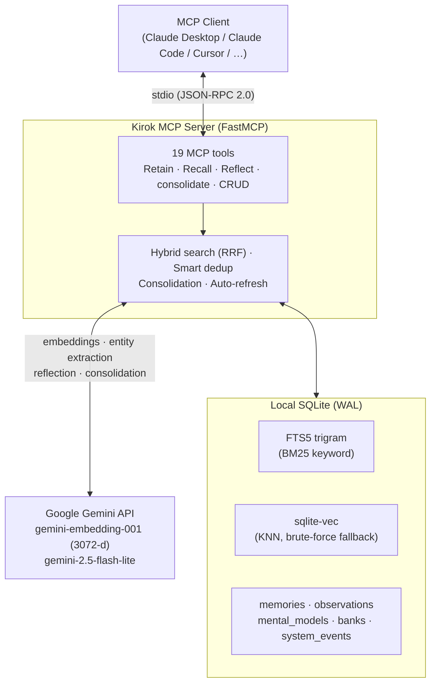

# Kirok

<!-- mcp-name: io.github.TadFuji/kirok-mcp -->

English | [日本語](README.ja.md)

[](https://github.com/TadFuji/kirok-mcp/actions/workflows/test.yml)
[](LICENSE)
[](https://www.python.org)
[](CHANGELOG.md)

**Persistent memory for AI agents, over MCP.** Kirok (記録, "record") is a [Model Context Protocol](https://modelcontextprotocol.io) server that gives an agent a durable, searchable memory: **Retain** what matters, **Recall** it with hybrid semantic + keyword search, and **Reflect** to distil accumulated memories into reusable insights. A background consolidation loop turns raw memories into higher-level *observations* on its own.


## Why Kirok

Most "agent memory" is either a flat vector store (recall is a bare cosine top-k, no keyword grounding, no forgetting) or a pile of markdown the agent has to re-read every turn. Kirok is a small, self-hostable server that does the retrieval engineering properly:

- **Hybrid retrieval, not just vectors.** Semantic KNN and FTS5 BM25 are fused with Reciprocal Rank Fusion, so an exact keyword match and a semantic match reinforce each other instead of competing.
- **A calibrated relevance floor.** Naive cosine thresholds don't work on real embedding distributions (see [Search quality](#-search-quality)); Kirok's floor is measured against live data, and there's an evaluation harness to keep it honest.
- **Autonomous consolidation.** Memories are periodically synthesised into observations, and destructive LLM decisions are soft-deleted with an audit trail rather than executed blindly.
- **Reliability first.** Atomic writes, soft deletes, startup auto-snapshots, and a fail-open background pipeline that never loses a `retain`.

**Not local-first:** storage is a local SQLite file you own, but embedding and LLM inference are sent to Google's Gemini API. If everything must stay on-device, Kirok is not for you (yet).

## Architecture



Storage is a single SQLite database at `~/.kirok/memory.db`. `sqlite-vec` provides per-bank vector KNN; if the native extension can't load, Kirok falls back to a NumPy brute-force scan with identical results. See [docs/architecture.md](docs/architecture.md) for the full design.

## 🚀 Quick start

**Requirements:** Python 3.12+, [uv](https://docs.astral.sh/uv/) (for `uvx`), and a [Gemini API key](https://aistudio.google.com/apikey) (free tier is plenty).

Kirok ships on [PyPI](https://pypi.org/project/kirok-mcp/) — nothing to clone. Put your key in `~/.kirok/.env` (one line: `GEMINI_API_KEY=AIza...`), then verify the setup:

```bash
uvx --from kirok-mcp kirok-doctor   # offline sanity check
```

### Connect an MCP client

**Claude Code CLI:**

```bash
claude mcp add kirok -s user -- uvx kirok-mcp
```

**Claude Desktop** — edit `claude_desktop_config.json` (macOS: `~/Library/Application Support/Claude/`, Windows: `%APPDATA%\Claude\`):

```json
{
  "mcpServers": {
    "kirok": { "command": "uvx", "args": ["kirok-mcp"] }
  }
}
```

Then restart the client. The server reads `GEMINI_API_KEY` from `~/.kirok/.env`; an `env` block in the client config also works and takes precedence.

### From source (development)

```bash
git clone https://github.com/TadFuji/kirok-mcp.git
cd kirok-mcp
uv sync                       # installs deps, including sqlite-vec
cp .env.example .env          # then put your key in it: GEMINI_API_KEY=AIza...
uv run kirok-doctor           # offline sanity check of the whole setup
```

Point your MCP client at the checkout with `uv run --directory /absolute/path/to/kirok-mcp kirok-mcp` instead of `uvx kirok-mcp`.

> [!TIP]
> **If `uv run` fails to launch the server** (common on Windows or cloud-synced folders — `uv run` re-syncs on every launch and can hit locked `.venv` files or an in-use entry-point `.exe`), invoke the venv's Python directly to skip the sync entirely:
>
> ```json
> {
>   "mcpServers": {
>     "kirok": {
>       "command": "/absolute/path/to/kirok-mcp/.venv/bin/python",
>       "args": ["-m", "kirok_mcp.server"],
>       "env": { "PYTHONPATH": "/absolute/path/to/kirok-mcp/src" }
>     }
>   }
> }
> ```
>
> On Windows use `.venv\\Scripts\\python.exe` and double-backslash paths in JSON.

A bundled agent skill in [`skills/kirok/`](skills/kirok/) teaches the agent when and how to use the memory tools on its own — point your client at `skills/kirok/SKILL.md` to enable it.

## 🛠️ Tools

19 MCP tools. One-line summaries below; full parameter tables in [docs/tools-reference.md](docs/tools-reference.md).

**Core**

| Tool | Purpose |
|------|---------|
| `KIROK_retain` | Store a memory: entity/keyword extraction + embedding + smart ADD/UPDATE/NOOP dedup |
| `KIROK_recall` | Hybrid semantic + keyword search (RRF), observations shown first |
| `KIROK_reflect` | Synthesise memories into a mental model (insight), optionally auto-refreshing |
| `KIROK_smart_retain` | Score importance (1–10) first, then retain only if it clears a threshold |
| `KIROK_consolidate` | Manually run observation consolidation for a bank |

**Memory management**

| Tool | Purpose |
|------|---------|
| `KIROK_get_memory` / `KIROK_list_memories` | Fetch one memory / browse a bank with pagination |
| `KIROK_update_memory` | Edit content or context (re-extracts and re-embeds on content change) |
| `KIROK_forget` | Delete a single memory (irreversible) |

**Mental models**

| Tool | Purpose |
|------|---------|
| `KIROK_list_mental_models` / `KIROK_get_mental_model` | List / inspect insights from Reflect |
| `KIROK_refresh_mental_model` | Re-analyse against current memories |
| `KIROK_delete_mental_model` | Delete a mental model (irreversible) |

**Banks**

| Tool | Purpose |
|------|---------|
| `KIROK_list_banks` / `KIROK_stats` | List banks with counts / detailed per-bank stats incl. background failures |
| `KIROK_clear_bank` | Delete a bank's memories + observations (requires `confirm=true`; previews otherwise) |
| `KIROK_delete_bank` | Delete a bank entirely (requires `confirm=true`; previews otherwise) |

**Config**

| Tool | Purpose |
|------|---------|
| `KIROK_set_bank_config` / `KIROK_get_bank_config` | Set / view a bank's retain & observation "missions" (what to focus on) |

## ⚙️ Configuration

Everything is set via environment variables (typically in `.env`). Only `GEMINI_API_KEY` is required.

| Variable | Default | Description |
|----------|---------|-------------|
| `GEMINI_API_KEY` | — | **Required.** Google Gemini API key. |
| `KIROK_DB_PATH` | `~/.kirok/memory.db` | SQLite database location. |
| `KIROK_DEDUP_THRESHOLD` | `0.85` | Cosine similarity above which retain invokes the LLM dedup (ADD/UPDATE/NOOP) decision. |
| `KIROK_RECALL_MIN_SIMILARITY` | `0.62` | Similarity floor for semantic memory hits in recall. Keyword/FTS hits are exempt. |
| `KIROK_OBS_MIN_SIMILARITY` | `0.62` | Similarity floor for observation hits in recall. |
| `KIROK_CONSOLIDATION_BATCH_SIZE` | `5` | Run auto-consolidation only once this many memories are pending (`1` = every retain). |
| `KIROK_CONSOLIDATION_TIMEOUT` | `120` | Consolidation timeout, seconds. |
| `KIROK_REFLECT_TIMEOUT` | `300` | Reflect timeout, seconds. |
| `KIROK_AUTO_SNAPSHOT_HOURS` | `24` | Min hours between startup auto-snapshots (`0` disables). |
| `KIROK_SNAPSHOT_KEEP` | `5` | Auto-snapshot generations to keep before rotating out the oldest. |

## 🔍 Search quality

Recall runs semantic KNN and FTS5 BM25 in parallel and fuses them with Reciprocal Rank Fusion (`k=60`). Short Japanese keyword queries get special handling: 1–2 character kanji/katakana tokens fall below the trigram tokenizer's 3-char window and can never `MATCH`, so they're rescued by an exact-substring `LIKE` supplement appended after the BM25 hits (hiragana-only short tokens stay excluded — function words would substring-match half a bank; tokens are OR-joined, matching the MATCH side).

Three details keep the hybrid honest: each source is fetched deeper than the final page (`max(limit*3, 30)`) so RRF can promote an item ranked just outside the cut in both lists; all FTS text is NFKC-normalized on both the index and query side, so width variants (ＭＣＰ vs MCP, ﾊﾞｸﾞ vs バグ) actually match; and observations get the same hybrid treatment as memories — semantic hits floored, keyword hits floor-exempt — instead of being reachable only through the semantic floor.

**The similarity floor is calibrated on real data.** A naive cosine threshold doesn't work here: on live `gemini-embedding-001` vectors the distribution is narrow — off-topic queries score **0.55–0.62** against unrelated banks while true hits score **0.66–0.73**. So the usable floor sits *just* above the off-topic ceiling, at **0.62**. Without it, an unrelated query still returns a full page of memories from any non-empty bank (context pollution); much lower and the floor filters nothing (the old hardcoded `0.4` sat below even off-topic scores). FTS keyword hits bypass the floor entirely — a literal term match is independent evidence, not a weak vector score.

Search parameters aren't tuned by vibes. [`scripts/search_eval.py`](scripts/search_eval.py) runs a golden query set through the *exact* recall pipeline the server uses (extracted as `hybrid_search_memories`, so the harness can't drift from production) and reports hit@1/hit@5/hit@k and MRR:

```bash
cp scripts/search_eval.example.json my_golden.json   # add 30–50 real cases
uv run python scripts/search_eval.py my_golden.json --limit 10
```

## 🛡️ Reliability

- **Atomic consolidation.** Every create/update embedding is generated *before* any DB write; all observation changes plus the "consolidated" mark commit in a single transaction. A failure at any step leaves the database exactly as it was, with the source memories still pending for a later retry — never a half-applied batch.
- **Failures surface, never fake success.** A consolidation LLM failure raises and is recorded to `system_events` — the batch stays pending for a later retry, instead of being silently marked consolidated with nothing produced. Runs are serialized per bank, so two retains landing together cannot double-process the same batch into duplicate observations.
- **Soft deletes with audit trail.** An observation the consolidation LLM decides to remove is stamped `deprecated_at` (excluded from search/list/stats) instead of destroyed, and a dedup UPDATE records the pre-merge content in the same transaction as the merge itself — both logged to `system_events` so a bad LLM decision is recoverable, not silent data loss.
- **Startup auto-snapshot.** On launch, if the newest auto-snapshot is older than `KIROK_AUTO_SNAPSHOT_HOURS`, a `VACUUM INTO` + `integrity_check` snapshot is written under `~/.kirok/backups/`, keeping the newest `KIROK_SNAPSHOT_KEEP` generations. A snapshot that fails partway leaves no broken file behind, and manual backups are never rotated.
- **Concurrency.** Connections set `PRAGMA busy_timeout=30000`, so a second MCP client waits out a busy writer instead of failing with `database is locked`.
- **Fail-open background work.** Auto-consolidation and mental-model refresh run behind `retain` and can never fail it — errors are swallowed, recorded to `system_events`, and surfaced via `KIROK_stats` so silent degradation stays visible.

## 💾 Backup & restore

All state is one SQLite file. The offline `kirok-backup` CLI needs no API key:

```bash
uv run kirok-backup snapshot        # byte-level DB copy (safe while server runs)
uv run kirok-backup export          # portable JSON of all banks + memories + observations + models
uv run kirok-backup import ~/.kirok/backups/kirok-export-YYYYMMDD-HHMMSS.json
```

`snapshot` and `export` write timestamped files under `~/.kirok/backups/` and refuse to overwrite. `import` runs in one transaction (all-or-nothing), skips existing IDs rather than overwriting, and rebuilds the FTS + vector indexes so search works immediately. Use `--db` to target a different database file.

## 🩺 Diagnostics

```bash
uv run kirok-doctor            # offline: Python version, .env, key presence (never printed),
                               # required modules, FTS5, sqlite-vec, DB writability
uv run kirok-doctor --json     # machine-readable, for automation
uv run kirok-doctor --online   # adds one live embedding call to verify Gemini connectivity
```

## 🧑‍💻 Development

```bash
uv sync
uv run --no-sync pytest        # 164 offline tests; no API key or network needed
```

The suite is fully offline — importing `kirok_mcp.server` is side-effect-free (the API key is checked at startup, not import) and tests swap in fake Gemini clients. CI runs the same suite on Ubuntu and Windows on every push ([.github/workflows/test.yml](.github/workflows/test.yml)). See [CONTRIBUTING.md](CONTRIBUTING.md) before opening a PR.

## 📚 Documentation

- [docs/architecture.md](docs/architecture.md) — internal design, data model, consolidation engine
- [docs/tools-reference.md](docs/tools-reference.md) — full parameter reference for all 19 tools
- [CHANGELOG.md](CHANGELOG.md) — version history (current: 1.4.2)

## 📄 License

MIT — see [LICENSE](LICENSE).

## Acknowledgements

- [Model Context Protocol](https://modelcontextprotocol.io) and the official [MCP Python SDK](https://github.com/modelcontextprotocol/python-sdk) (FastMCP)
- [Google Gemini API](https://ai.google.dev/) for embeddings and LLM
- [Mem0](https://github.com/mem0ai/mem0) — inspiration for smart deduplication and the knowledge layer
- [Reciprocal Rank Fusion](https://plg.uwaterloo.ca/~gvcormac/cormacksigir09-rrf.pdf) (Cormack et al., 2009)
